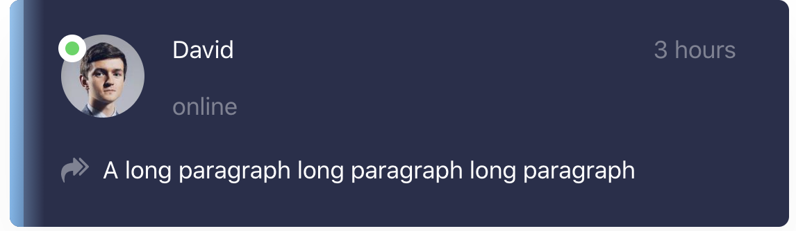
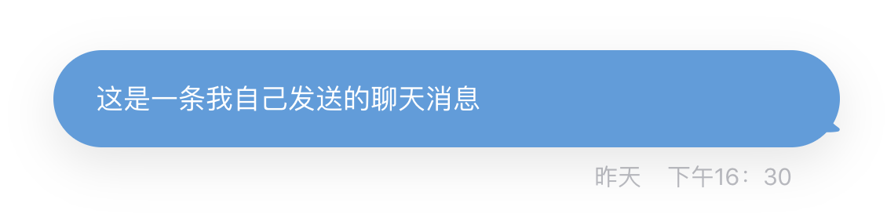
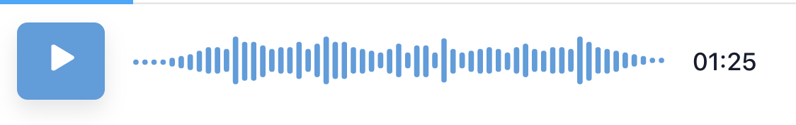

# 🔥 react-chat-app

A UI library of react for online chat application.

## Installation

`npm i react-chat-app`  
`yarn add react-chat-app`

## API Document
`git clone https://github.com/Yaozu-Xu/react-chat-app`  
`yarn dev`  
`yarn install`  
`yarn storybook`  
visit http://localhost:6006/

## Usage

```javascript
import { Card, Bubble } from 'react-chat-app'
import avatar1 from 'face-male-1.jpg'
// Card Example
const RepliedActiveCard = () => (
  <Card
    avatarUrl={avatar1}
    title="David"
    avatarStatus="online"
    subtitle="online"
    rightLabel="3 hours"
    description="A long paragraph long paragraph long paragraph"
    unreadCount={2}
    active
  />
)
// Bubble Example
export const BubbleFromMe = () => (
  <Bubble type="from" time="昨天 下午16：30">
    Bubble Content
  </Bubble>
)
```
## Screenshots

<br>

<br>

<br>


